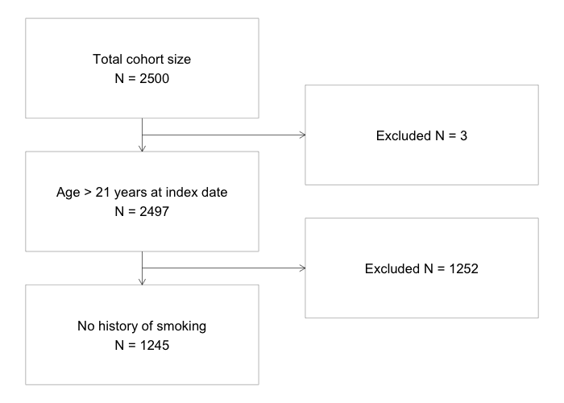

# README

## Background

This repository complements the `Let's git it started` introduction to
git for reproducible analytic workflows in real-world evidence (RWE)
studies.

<u>Note</u>: This is an example repository based on the HARPER
template<sup>1</sup> (available under
[gitlab-scm.partners.org/drugepi/harper](https://gitlab-scm.partners.org/drugepi/harper))
that uses a toy example to demonstrate the composition of a potential
RWE study repository and how to version-control and track changes.

## Mock study

### Dataset

For this mock study we will use the `smdi_data_complete` dataset that
comes with the smdi R package.<sup>2</sup>

### Background

``` r
library(smdi)
suppressPackageStartupMessages(library(dplyr))

# smdi_data_complete does not come with
# a patient ID, so we artificially create
# one for this example
data <- smdi_data_complete |> 
  mutate(patientID = as.character(paste0("patientID", row_number())))

data |> 
  glimpse()
```

    Rows: 2,500
    Columns: 15
    $ exposure      <int> 1, 1, 0, 1, 1, 0, 1, 0, 1, 1, 0, 1, 1, 0, 0, 1, 1, 0, 0,…
    $ age_num       <dbl> 35.24, 51.18, 88.17, 50.79, 40.52, 64.57, 73.58, 42.38, …
    $ female_cat    <int> 1, 0, 0, 0, 0, 0, 0, 1, 1, 1, 1, 0, 0, 1, 0, 0, 1, 1, 1,…
    $ ecog_cat      <int> 1, 0, 0, 1, 0, 0, 1, 0, 1, 1, 1, 0, 0, 1, 1, 0, 1, 1, 1,…
    $ smoking_cat   <int> 1, 1, 0, 1, 1, 0, 1, 1, 1, 0, 0, 1, 1, 1, 1, 0, 1, 0, 1,…
    $ physical_cat  <int> 0, 1, 0, 0, 0, 0, 0, 0, 1, 0, 0, 0, 0, 0, 1, 0, 1, 0, 0,…
    $ egfr_cat      <int> 1, 0, 1, 1, 1, 0, 1, 0, 0, 0, 1, 1, 0, 0, 0, 0, 0, 1, 1,…
    $ alk_cat       <int> 0, 0, 0, 0, 0, 0, 0, 0, 0, 0, 0, 0, 0, 0, 0, 0, 0, 0, 0,…
    $ pdl1_num      <dbl> 45.03, 43.54, 41.74, 45.51, 31.28, 38.01, 47.28, 37.28, …
    $ histology_cat <int> 1, 1, 0, 0, 0, 0, 0, 0, 0, 0, 0, 1, 0, 0, 0, 0, 1, 0, 0,…
    $ ses_cat       <chr> "2_middle", "3_high", "2_middle", "2_middle", "2_middle"…
    $ copd_cat      <int> 1, 0, 1, 1, 1, 0, 1, 1, 1, 1, 0, 1, 1, 1, 1, 0, 1, 0, 1,…
    $ eventtime     <dbl> 5.000000000, 4.754220474, 0.253391563, 5.000000000, 5.00…
    $ status        <int> 0, 1, 1, 0, 0, 1, 1, 0, 1, 1, 1, 1, 1, 1, 1, 0, 0, 1, 1,…
    $ patientID     <chr> "patientID1", "patientID2", "patientID3", "patientID4", …

Let’s assume we want to conduct a RWE study comparing two antineoplastic
treatments in the context of real-world overall survival (rwOS)
outcomes.

### Eligibility criteria

For this example we want to apply a couple of eligibility criteria,
i.e.,

1.  Age \> 21 years at index date (`age_num > 21`)

2.  No history of smoking (`smoking_cat == 0`)

Add a third condition, which is no evidence of an EGFR gene mutation.

``` r
library(visR)

attrition <- get_attrition(
  # dataset
  data = data,
  
  # labels                               
  criteria_descriptions = c(
    "Age > 21 years at index date"
    , "No history of smoking"
    , "No EGFR mutation"
    ),
  # coded condition
  criteria_conditions   = c(
    "age_num > 21"
    , "smoking_cat == 0"
    , "egfr_cat == 0"
    ),
  # patient ID column
  subject_column_name   = "patientID"
  
  )

# apply attrition steps: [-1] just removes the first attrition 
# condition in the table which is "none"
data_eligible <- apply_attrition(data, attrition$Condition[-1])

visr(
  x = attrition,
  description_column_name = "Criteria", 
  value_column_name = "Remaining N"
  )
```



### Propensity score matching

We perform a 1:1 propensity score matching<sup>3</sup>, adjusting for
pre-exposure covariates to control for confounding bias.

``` r
library(MatchIt)
suppressPackageStartupMessages(library(cobalt))
# specify ps model
exposure_form <- as.formula("exposure ~ age_num + female_cat + ses_cat")

# estimate 1:1 propensity score matching
# with 0.2 caliper on propensity score
ps_matching <- matchit(
  formula = exposure_form,
  data = data_eligible,
  ratio = 1,
  method = "nearest",
  distance = "glm",
  link = "logit",
  caliper = 0.2,
  replace = F
  )

# visualize covariate balance
love.plot(
  x = ps_matching,
  abs = TRUE, # if absolute values should be plotted
  thresholds = 0.1, # vertical line with "balance" threshold
  drop.distance = TRUE, # should the distance measure be removed
  var.order = "unadjusted", # variable order on y-axis
  colors = c("blue", "orange"), # first color =  unadjusted sample, second = adjusted sample
  stars = "std", # to indicate mean differences that have been standardized
  shapes = 17, # the shape of the SMD geometries
  size = 4, # the size of the SMD gemotries
  grid = TRUE,
  position = "top" # legend position
  )
```


### Estimating marginal hazard ratio

We now estimate the final marginal hazard ratio in the propensity score
matched cohort to estimate the treatment effect (see also
[here](https://kosukeimai.github.io/MatchIt/articles/estimating-effects.html#survival-outcomes)).

``` r
# use propensity score matched cohort
data_matched <- match.data(ps_matching)

library(survival)
library(broom)

#Cox Regression for marginal HR
coxph(
  formula = Surv(eventtime, status) ~ exposure, 
  data = data_matched, 
  robust = TRUE, 
  weights = weights, 
  cluster = subclass
  ) |> 
  tidy(exponentiate = TRUE, conf.int = TRUE) |> 
  select(term, estimate, robust.se, conf.low, conf.high)
```

    # A tibble: 1 × 5
      term     estimate robust.se conf.low conf.high
      <chr>       <dbl>     <dbl>    <dbl>     <dbl>
    1 exposure    0.916    0.0842    0.776      1.08

## Appendix

### Repository details

This pre-populated example repository is conceptualized for a typical
RWE study with the following sub-directories/-files:

- `README.md`: Short description and information about the repository as
  well as mock study.

- `protocol`: HARPER quarto template (`protocol.qmd`) with empty table
  shells included in the protocol, template for study design figures and
  HARPER pdf template. It also contains a pre-configured
  `references.bib` BibTex file for citations/references one may want to
  include in the protocol.

- `documentation`: Sub-directory for documentation materials, e.g. data
  dictionaries or IRB approval letters.

- `scripts`: Sub-directory for R/Python analysis scripts. It is
  recommended to have a clear labeling such as: *1_data_query.qmd*,
  *2_descriptives.qmd*, *3_main_analysis.qmd*,
  *4_sensitivity_analysis.qmd*, etc.

- `functions`: Custom R/Python functions to be sourced in analysis
  scripts.

- `results`: Sub-directory for collecting publication-ready tables,
  figures and other material relevant to communicate results.

- `public`: output directory for all quarto scripts and resources
  published on the website. This is particularly useful to publish
  annotated and interactive outputs along with a peer-reviewed
  manuscript as a measure of enhanced transparency and reproducibility
  and a way to augment and support study results. The name of the output
  directory can be customized in the `_quarto.yml` file according to
  specific system needs (for more details see the [quarto
  website](https://quarto.org/docs/projects/quarto-projects.html)).

- `manuscript`: Sub-directory where manuscript and supplementary
  material can be drafted and stored.

- `renv`: Project-specific R package library. Fore more information,
  please visit the [renv
  website](https://rstudio.github.io/renv/articles/renv.html).

- `.gitignore`: File to specify which files should not be tracked via
  git.

- `.Rprofile`: Environment file for R projects to store things like
  paths or keys (you can also setup an `.Renviron`)

- `.gitlab-ci.yml`: Pre-configured template. The `.gitlab-ci.yml`
  defines the GitLab continuous integration and deployment (CI/CD). This
  file may need to be adjusted to your specific project and installed
  GitLab runner(s).

Of course you can customize and remove/add other files and directories.

## Further readings

## Advanced readings on `Git` and other resources

- Main `Git` website to download and learn more about `Git:`
  <https://git-scm.com>

- [Pro Git](https://git-scm.com/book/en/v2) by Scott Chacon and Ben
  Straub.

- Comprehensive guide on the use of Git in combination with R:
  <https://happygitwithr.com/>

- Cheatsheet on most important `Git` commands:
  <https://education.github.com/git-cheat-sheet-education.pdf>

- GitHub Desktop App: <https://desktop.github.com/>

- Git manual by *Atlassian* (provider of the `Bitbucket` platform):
  <https://www.atlassian.com/git>

- Coursera courses:

  - [Introduction to Git and
    GitHub](https://www.coursera.org/learn/introduction-git-github)
    (Google)

  - [Version Control with
    Git](https://www.coursera.org/learn/version-control-with-git)
    (Atlassian)

  - [Getting Started with Git and
    GitHub](https://www.coursera.org/learn/getting-started-with-git-and-github)
    (IBM)

  - [Making Data Science Work for Clinical
    Reporting](https://www.coursera.org/learn/making-data-science-work-for-clinical-reporting?=)
    (Genentech)

- Quarto (open-source scientific and technical publishing system for
  reproducible research): <https://quarto.org>

- Choosing a suitable license for a remote repository: Public
  repositories need to be licensed to be truly open source. If no
  license is provided, the work is by default under exclusive copyright.
  The website <https://choosealicense.com> provides an excellent
  overview of the different types of licenses.

- Useful Git repositories for observational healthcare research:

  - Division of Pharmacoepidemiology and Pharmacoeconomics:
    <https://gitlab-scm.partners.org/drugepi>

  - Observational Health Data Sciences and Informatics (OHDSI):
    <https://github.com/OHDSI>

  - Darwin EU® Private Development Repository:
    <https://github.com/darwin-eu-dev>

  - Pharmaverse (Network of developers of curated open source R packages
    for clinical reporting):
    [https://pharmaverse.org](https://pharmaverse.orghttps://pharmaverse.org)
    & <https://github.com/pharmaverse/>

## References

<div id="refs" class="references csl-bib-body">

<div id="ref-wang2022harmonized" class="csl-entry">

<span class="csl-left-margin">1.
</span><span class="csl-right-inline">Wang SV, Pottegård A, Crown W, *et
al.* HARmonized protocol template to enhance reproducibility of
hypothesis evaluating real-world evidence studies on treatment effects:
A good practices report of a joint ISPE/ISPOR task force. *Value in
Health* 2022; **25**: 1663–1672.</span>

</div>

<div id="ref-smdi" class="csl-entry">

<span class="csl-left-margin">2.
</span><span class="csl-right-inline">Weberpals J. Smdi: Perform
structural missing data investigations. 2023. Available at:
<https://janickweberpals.gitlab-pages.partners.org/smdi>.</span>

</div>

<div id="ref-MatchIt" class="csl-entry">

<span class="csl-left-margin">3.
</span><span class="csl-right-inline">Ho DE, Imai K, King G, Stuart EA.
MatchIt: Nonparametric preprocessing for parametric causal inference.
2011; **42**.
doi:[10.18637/jss.v042.i08](https://doi.org/10.18637/jss.v042.i08).</span>

</div>

</div>
